# Movie Booking System


## About The Project

A movie booking
system is a software application that allows users to purchase tickets for movies at a cinema. The
system typically includes a user interface that allows users to search for available showtimes, select
seats, and complete the transaction using a credit card or other payment method. Some systems
may also include features such as the ability to view trailers, read reviews, and reserve tickets in
advance. The goal of a movie booking system is to make the process of buying movie tickets as
convenient and efficient as possible for both the user and the cinema

### Built With

- [Android Studio](https://developer.android.com/studio)
- [Java](https://www.java.com/en/)
- [Firebase](https://firebase.google.com/)
- [Adobe XD](https://www.adobe.com/products/xd.html)

## Getting Started

### Prerequisites

- Android Studio
- Java
- Adobe XD
- MySQL
- IntelliJ IDEA

### Installation

1. Clone the repo
   ```sh
   git clone https://github.com/ravindu0823/Java-Group-Project
   ```
2. Open the project in IntelliJ IDEA
3. Run the project

## Usage

### Admin Login

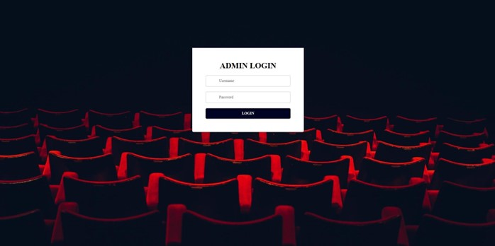

### Admin Dashboard

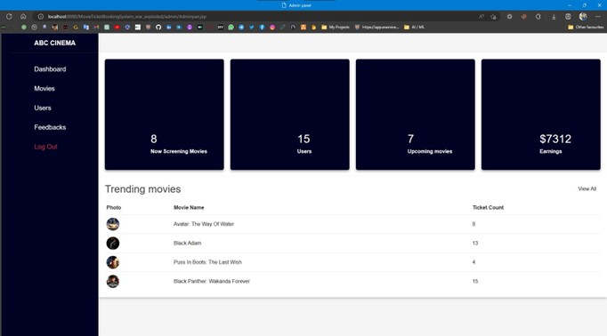

### Movie Details

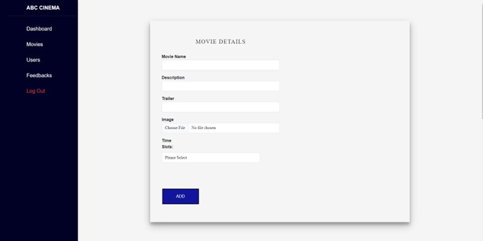
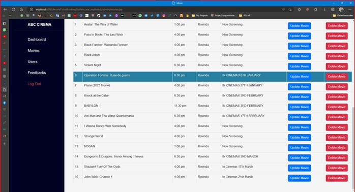


### User Details

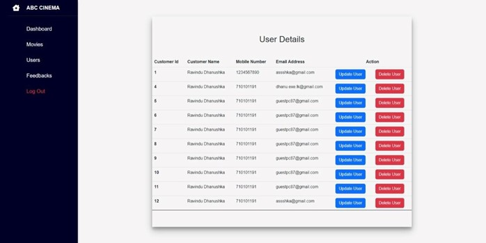
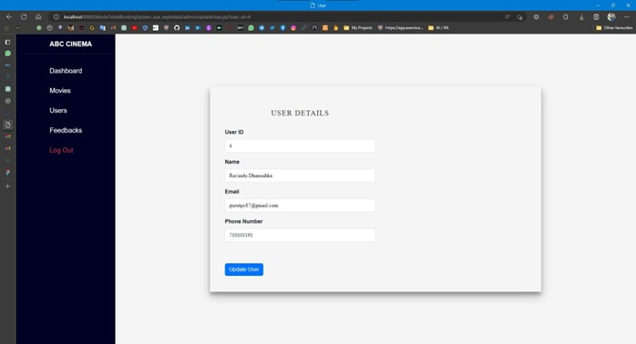

### Feedback

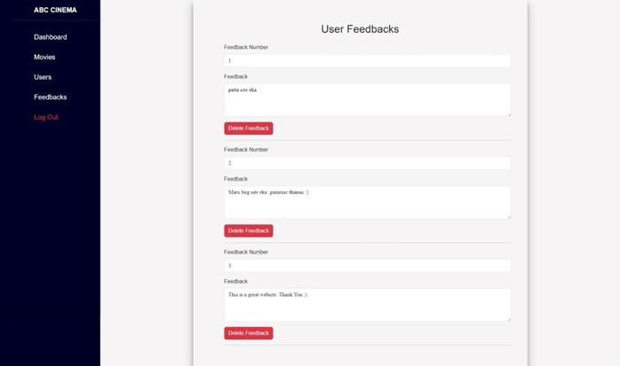

### Homepage


### News

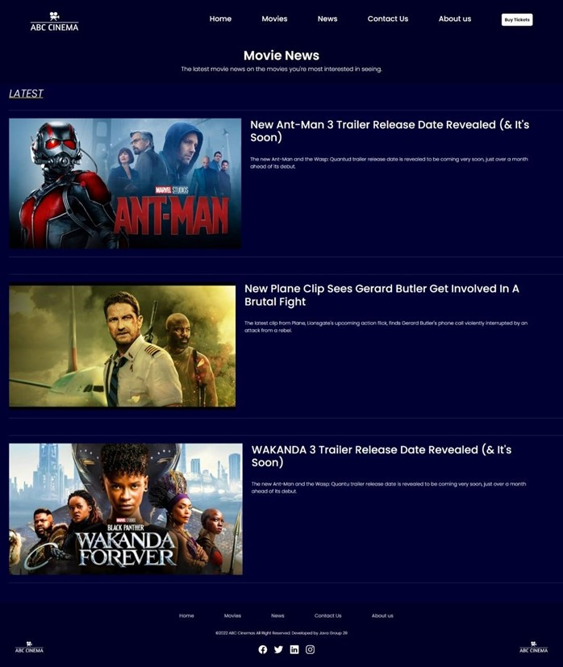

### Booking

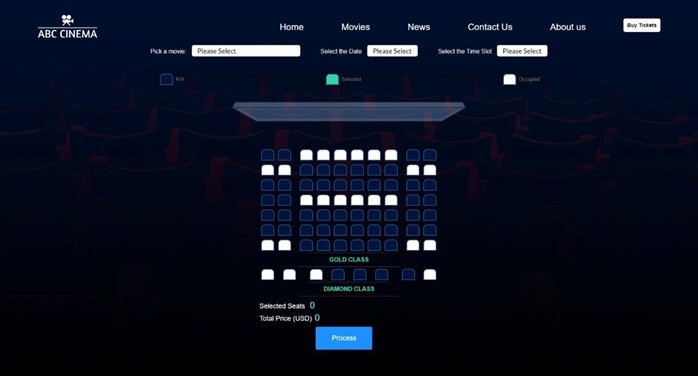

### Checkout

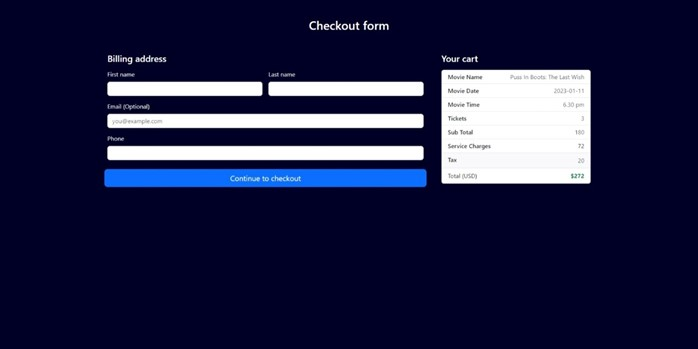

### Payment

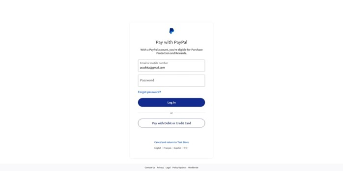
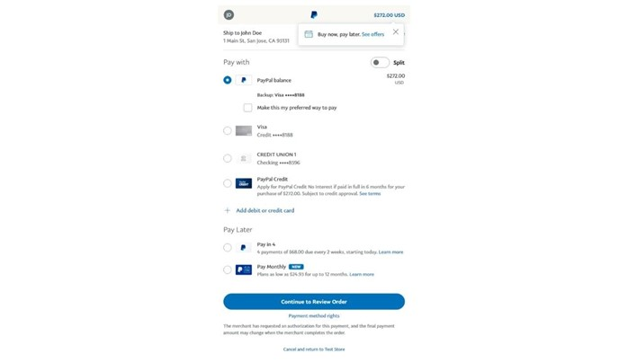

### Review

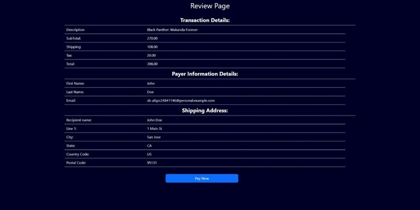

### Success

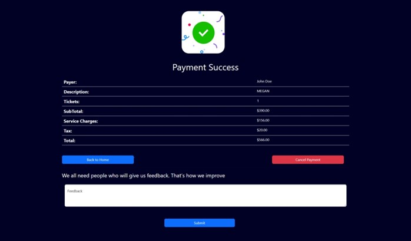